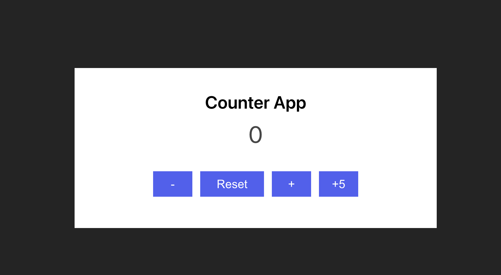

# Apps using useState hook

## Initializing & starting the app

- Initialize your app by navigating to starter directory
- Execute the commands below to start the app in starter directory (always start from the root directory use-state-react)

```
cd starter
npm i
npm run dev
```

- Execute the commands below to start the app in final directory (always start from the root directory use-state-react)

```
cd final
npm i
npm run dev
```

### Objectives:

- Using useState react hook
- Adding functionalities to Counter App
  - increment
  - decrement
  - increment by 5 and
  - reset
- Add functionalities to Slider App
  - add buttons to slide images to left or right
  - add images at the bottom of the main image and then clicking the image update it to the selected image index
- Use starter directory to add the functionalities, refer to final directory for a working a solution

#### Outputs

1. Counter App

   

2. Slider App

   
